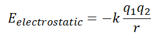
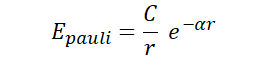
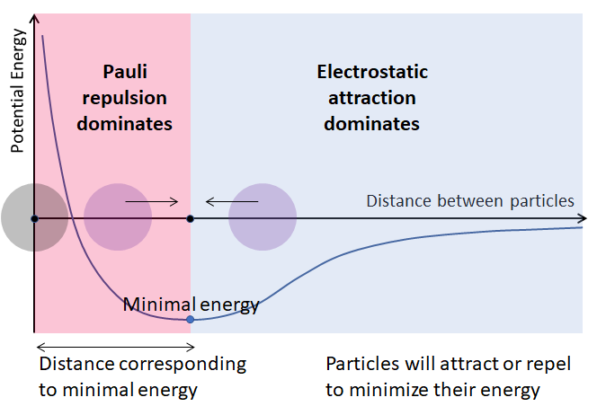
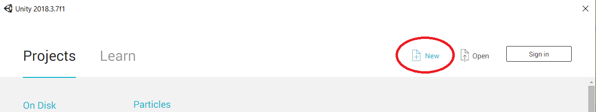
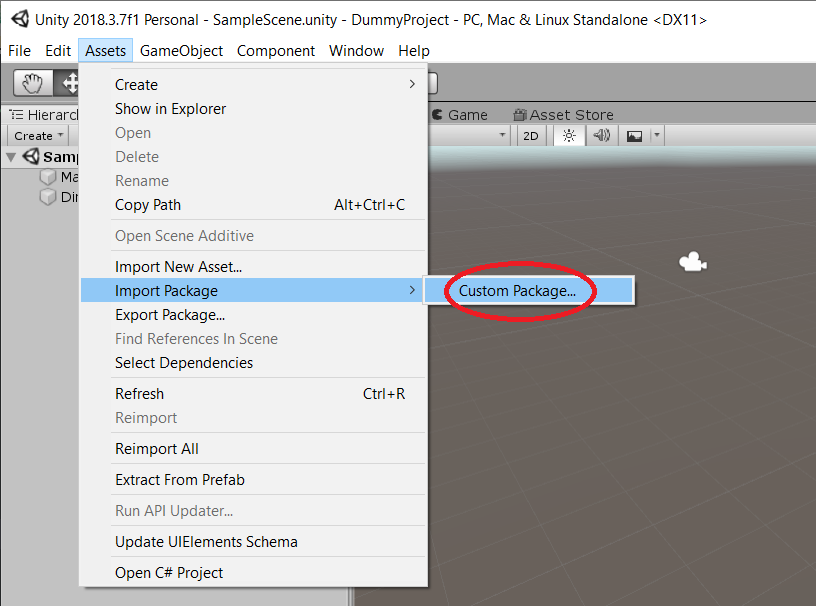

# Simple Particle Interaction
## Description
You've probably heard that all known life is carbon-based because, with physical constants being as they are, carbon is the only element that can form long chains which are needed to support complex life. You were probably also wondering what would happen if you could just freely toggle the physical constants: how would things evolve if other elements would form chains, or if instread of forming chains they would preferably form rings, or clumps, or whatnot...<br>

Here we're not going to tackle the really big questions, instead we're going to explore charged particle interaction using some fairly simple high-school physics. Turns out, this can also be pretty enlightening:

</img>

Here are some basic details about this particle sandbox:
- only charged particles are allowed in the sandbox;
- charged particles are represented by rigid balls with size proportional to charge (this is gross oversimplification, as dependence between [ionic charge and its radius](https://en.wikipedia.org/wiki/Ionic_radius) is slightely more intricate. However, here we'll use size as an indicator for charge simply for better "readability");
- only two types of interactions (aside from elastic collisions) are considered for each pair of particles:
  - *Electrostatic attraction/repulsion*: particles with oppisite charges attract, while particles with the same charge repel. It is intuitive that if two particles are infinitely far apart their interaction energy should be close to zero. While if two oppositely charged particles are close, pulling them apart would require some energy input and, thus, increase the energy of the system. Therefore, energy corresponding to electrostatic interaction should be negative and inversely proportional to distance:
  <br>
  </img>
  <br>
    q1,q2 - are the particle charges<br>
    r - is the distance between the particles<br>
    k - is the parameter that we can toggle in the sandbox.<br><br>
  
  - *Pauli repulsion*: as two atoms (or ions) are pushed closer together and their electron shells start to overlap we run into situation when more than two electrons become residents of a single orbital, which should never be the case according to [Pauli Exclusion Principle](https://en.wikipedia.org/wiki/Pauli_exclusion_principle). Since the "intruding" electrons cannot remain at the orbital that already has maximal number of residents, they have to "migrate" to the higher shells, which requires massive energy investments:
  <br>
  </img>
  <br>
  C and alpha - are parameters that we can toggle in the sandbox.

  The combined effect of these two types of interaction looks like this:
  </img>
  Of course varying the particle charges and toggling the parameters (k, C and alpha) would change the exact shape of the curve. Try it yourlsef!

## Getting Started
### Prerequisites
*If you want to tinker with the code* and test the result you'd need to have [Unity](https://unity.com/) 2018 or higher installed.

*If you just want to play* with (over-)simplified particle physics - you're good to go.

### Installing
*If you want to tinker with the code*, instead of cloning this entire repo it would be easier to make a new project in Unity and import this project's asset package.

To do that first download the asset package file (`ParticlesAssets.unitypackage`) to a new directory (e.g., `particles_assets`):
In your terminal:
```
$ mkdir particles_assets
$ cd particles_assets
$ curl -L https://raw.githubusercontent.com/axyorah/simple_particles/master/ParticlesAssets.unitypackage -O ParticlesAssets.unitypackage
```

Next, go to Unity and create new project:

</img>

In your new project inspector go to Assets/Import Package/Custom Package and navigate to your newly downloaded `ParticlesAssets.unitypackage`

</img>

You should now have all the necessary files. To confirm that everything went as expected hit the Play button and toggle the controls.

*If you just want to play* with this sandbox, download one of the `...Build.tar.gz` archives and run the executable file:

If you have Windows machine download and unpack `Builds/ParticlesWindowsBuild.tar.gz`:
```
$ curl -L https://github.com/axyorah/simple_particles/raw/master/Builds/ParticlesWindowsBuild.tar.gz -O ParticlesWindowsBuild.tar.gz
$ tar -xzvf ParticlesWindowsBuild.tar.gz
```
In unpacked ParticlesWindowsBuild directory run the executable `Particles.exe`.

## Acknowledgements
This sandbox was largely inspired by the amazing people from [gamedevtv](https://www.gamedev.tv/)!<br>
The starry background is taken the [Game Physics course](https://www.udemy.com/course/gamephysics/learn/lecture/3836902#overview) materials.
